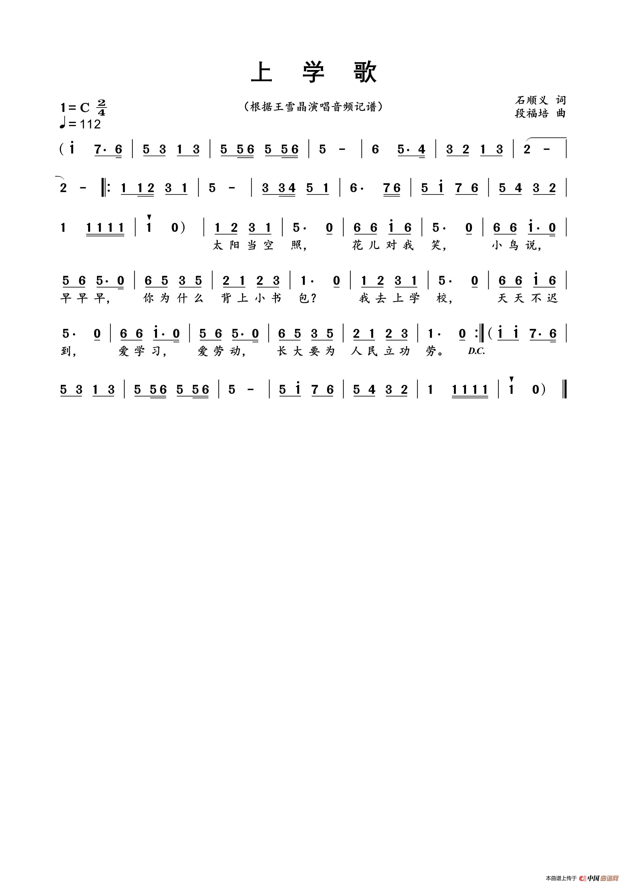
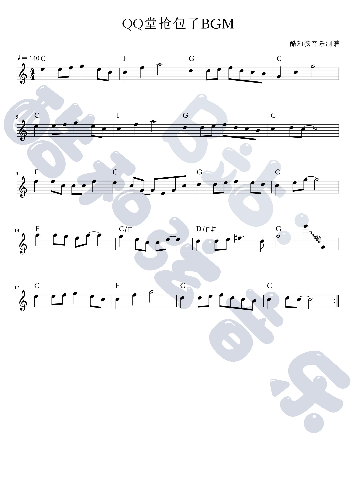
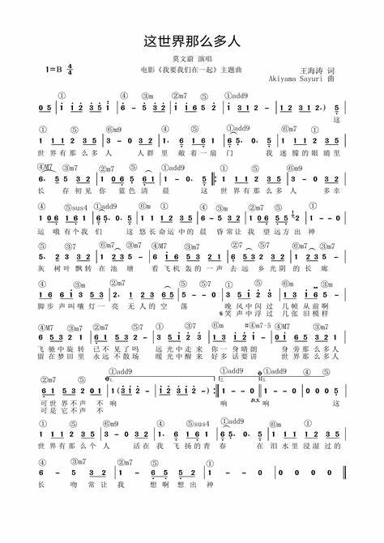
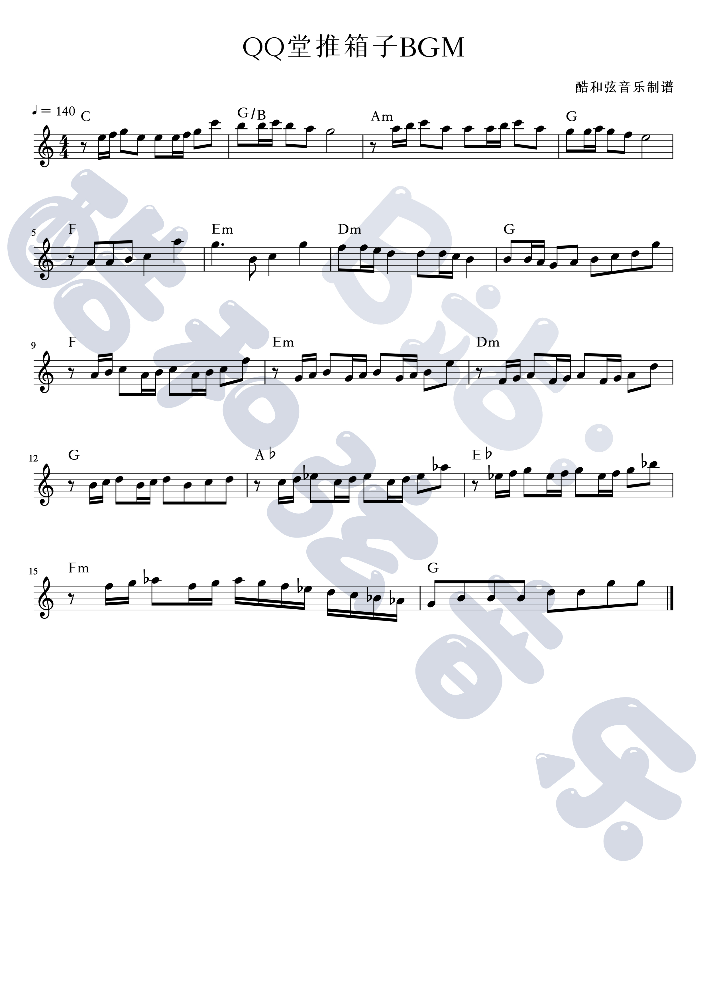

[TOC]

# Java MIDI 音乐编程入门 + 基础乐理知识 for programmers

## 基础乐理知识

### 简谱阅读入门

下面以《上学歌》为例讲解简谱的阅读方式和相关的乐理知识。

上图只有高音部分，因此还需要[参考链接1](https://tv.sohu.com/v/dXMvMzM1OTQyMjA2LzE0Nzk5Nzk3Ni5zaHRtbA==.html)补充低音部分。

左上角的分数是拍号（节拍符号），分母表示多少个音节为一拍，分子表示一小节多少拍。

左上角的`🎶 = 112`表示一分钟112拍，对应代码里的`bpm`（beats per minute）。据此可以计算出每个音符的演奏时间，不过实际演奏中并不需要这么做。

左上角的`1 = C`表示这首歌的**调式**为C自然大调。调式确定了歌曲的音域范围。在钢琴键盘中，音名`C3`被称为中央C，因为它位于钢琴键盘的中间。C自然大调的含义就是升0个八度的唱名`do`对应`C3`，由此可推出升1个八度的唱名`do`对应`C4`，降1个八度的唱名`do`对应`C2`。同理，`1 = D`为D自然大调，升0个八度的唱名`do`对应`D3`，`do up`对应`#D3`，`re`对应`E`等。

例如，《上学歌》为C自然大调，`bpm = 112`，4音节一拍，一小节2拍。

上面提到了`#D3`，这是什么音名？首先我们需要引入半音和全音的概念。在钢琴白键中`E, F`、`B, C`没有黑键隔开，是半音关系；其他的都有黑键隔开，是全音关系。理解半音和全音的概念后，就可以讲黑键的音名了。`#D3`就是`D3`右侧的黑键，称为升`D3`。因为它也在`E3`的左侧，所以也可以称为降`E3`，记为`b E3`。例如，在《菊次郎的夏天》简谱（其简谱图在下文《菊次郎的夏天Demo》一节）第十一节有一个音`#4`，它表示`fa up`。

上面还提到了“八度”，那什么是八度？**音程**是两个音之间的距离，单位是“度”。在钢琴键盘上，有多少白键就是多少度。比如`C3`到`A3`为6度，`C3`到`B3`为7度，`C3`到`C4`为8度。对于升降音，需要先还原到白键才能确定音程。比如`#C3`到`A3`为6度。

接下来看《上学歌》的第一节。`1 2`和`3 1`有下划线，表示这一节的两拍，因此每个音符占0.5拍。第二节的`5.`表示附点四分音符，占1.5拍，随后紧跟的0是八分休止符，占0.5拍。第三节的1上面有一个点，表示这个`do`需要高1个八度。第五节的`1.`有1条下划线，`0`有两条下划线，这表示`1.`是附点八分音符，需要高一个八度，占0.75拍，休止符占0.25拍。

### 五线谱阅读入门

下面以《qq堂抢包子》为例讲解五线谱的阅读方式。

《qq堂抢包子bgm》为C自然大调，`bpm = 140`，4音节一拍，一小节4拍。

我们将五线谱的五条线从下到上分别命名为第一线到第五线，线与线之间从下到上分别命名为第一间到第四间。线的下方和上方都可以继续添加线，称为上加一线和下加一线等。怎样快速看出每个音符的音高呢？在高音谱表中有一个口诀：4613。这个口诀是什么含义呢？我们知道曲目常见的调式为C自然大调，所以口诀表示在C自然大调的高音谱表中第一间到第四间的唱法分别为fa、la、do、mi，也就是`F3`、`A3`、`C4`、`E4`。

五线谱每一行最左侧的符号为高音谱号，对应的符号还有中音谱号、低音谱号等。高音谱表和低音谱表的谱线表示的音高不同。简单来说，高音谱表和低音谱表是轴对称的，高音谱表的下加一线和低音谱表的上加一线都表示`C3`，也就是钢琴的中央C。据此有推论，C2在低音谱的第二间，C4在高音谱表的第三间。这时你可能会有疑问，为什么要引入高音谱号和低音谱号呢？简单点不好嘛？原因很简单，一首钢琴曲往往有低音部分（一般左手弹）和高音部分（一般右手弹），如果只使用高音谱表，那么低音部分很可能需要在下方加不少线，这就不方便了。

该曲的第一个音符是四分音符，占一拍。第二个音符是两个八分音符，各占二分之一拍。所以总体上第一节有4拍。第二节的最后一个空心的音符是二分音符，在上加一线所以是`A4`。第八节有一条连音线，表示`C4`要演奏`0.5 + 2 = 2.5`拍。第十五节的井号跟着的音符表示要升半音，因此是`fa up`，后面还跟着一个点表示这个音符是附点四分音符，要演奏1.5拍。第十五节的最后一个音符是一个八分音符。所以总体上第十五节同样有4拍。第十六节有一个`gliss`符号表示这个音要刮奏，从`G5`刮到`G3`，总共占2拍，因此在代码中这里每个音符要演奏`1 / 7`拍。

## 上学歌Demo

[代码传送门](https://github.com/Hans774882968/java-midi-demo/blob/main/src/%E4%B8%8A%E5%AD%A6%E6%AD%8CDemo.java)

简单讲下代码结构：

1. main函数的模板基本上不变。
2. `MyNoteImpl myNoteImpl = new MyNoteImpl(MyNote.Major.C);`设置调式为C自然大调。
3. `player.setTempoInBPM(112);`设置`bpm = 112`。
4. `上学歌left`和`上学歌right`分别处理低音和高音部分。对于里面的`addNote`调用，我们基本上只需要关注第3个参数和最后两个参数：第3个参数的`myNoteImpl.getDo(-1)`表示`do`低1个八度。倒数第二个参数表示这个音演奏多少拍。最后一个参数在顿音中设置为`tick + 该音播放时间 / 4`即可，在非顿音中设置为`tick + length`即可。

## 这世界那么多人Demo

[代码传送门](https://github.com/Hans774882968/java-midi-demo/blob/main/src/这世界那么多人Demo.java)

1. 这首曲子难度不高，我自己用它来检验我对乐理知识的理解的正确性。如果对节拍的理解正确，那么你会发现歌曲的第一部分演奏完的时间是2分10秒左右。
2. 上面的简谱没有体现，从其他渠道查到`bpm = 72`。

## qq堂抢包子Demo

[代码传送门](https://github.com/Hans774882968/java-midi-demo/blob/main/src/qq堂抢包子Demo.java)

所需的乐理知识在上文已经讲解完毕，代码结构也与“上学歌Demo”一致，在此不赘述。

## qq堂推箱子Demo

[代码传送门](https://github.com/Hans774882968/java-midi-demo/blob/main/src/qq堂推箱子Demo.java)

1. 第一节的第一个音符是八分休止符，占0.5拍。
2. 第一节的第二个音符共占0.5拍，第四个音符的3个音分别占0.5、0.25、0.25拍。
3. 第十三节的“♭”是临时降半音符号，按照惯例，其作用范围是当前小节的所有相同音。因此当前节总共有`3 + 1 = 4`个符号需要降半音。这个结论在视频中得到了验证，这一节总共按了4下黑键。
4. 代码结构与《qq堂抢包子Demo》一致，不赘述。

## 菊次郎的夏天Demo

[代码传送门](https://github.com/Hans774882968/java-midi-demo/blob/main/src/%E8%8F%8A%E6%AC%A1%E9%83%8E%E7%9A%84%E5%A4%8F%E5%A4%A9Demo.java)

这首曲子是最难的，因此放到本文的最后一节来实现。

1. 顿音符号：可以看到该曲简谱有不少空心倒三角，这就是顿音符号。在代码中，我们传入`endTick = tick + 该音播放时间 / 4`来表示顿音。
2. 延音符号：第五节的圆弧是延音符号，表示需要延长`do`的演奏时间，但颜色为灰色，所以最终视为和休止符效果相同。
3. 和五线谱同理，按照惯例，第十一节的每个4都应该升半音。
4. 可以看到右手出现了需要三个手指同时按键的现象，为此我引入了`菊次郎的夏天right2, 菊次郎的夏天right3`方法。
5. 代码引入了`AddNoteParams`类，这是为了能够引入以小节为单位的二维数组，从而更方便地实现仅播放某一个片段。这个想法再扩展一下，就是引入一个DSL来描述一首曲子。因为我写这篇blog的目标是检验自己对乐理知识的理解的正确性，所以就只做到硬编码这一步了。

## 总结

一个之前没想到过的视角：乐理知识是一种可以用代码进行验证的技术。

## 参考资料

1. [《上学歌》高音和低音部分简谱](https://tv.sohu.com/v/dXMvMzM1OTQyMjA2LzE0Nzk5Nzk3Ni5zaHRtbA==.html)
2. 乐理入门教程：https://b23.tv/cPsBkTn
