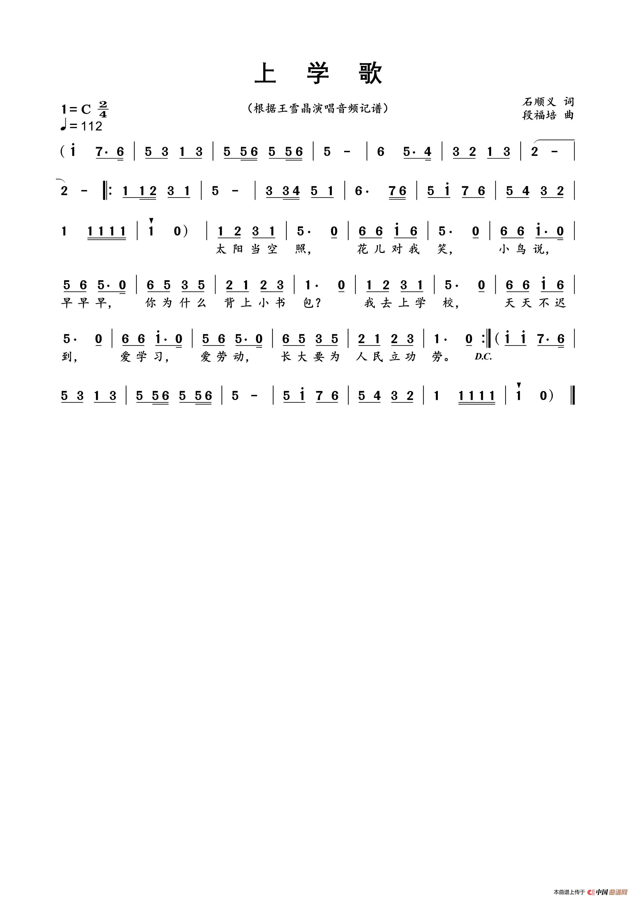
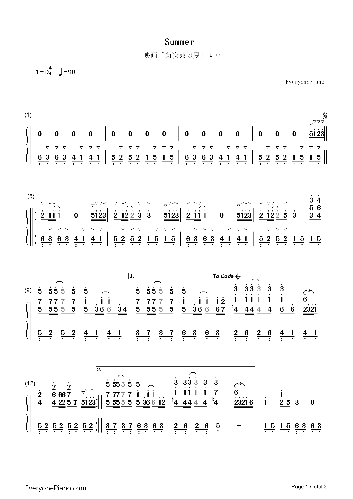

[toc]

# Java 音乐编程入门 + 基础乐理知识 for programmers

## 基础乐理知识

下面以《上学歌》为例讲解本文所需的乐理知识。

上图只有高音部分，因此还需要[参考链接1](https://tv.sohu.com/v/dXMvMzM1OTQyMjA2LzE0Nzk5Nzk3Ni5zaHRtbA==.html)的补充。

分母表示多少个音节为一拍，分子表示一小节多少拍。

一分钟多少拍，对应代码里的`bpm`（beats per minute）。

《上学歌》为C调，`bpm = 112`，4音节一拍，一小节2拍。

顿音

## 上学歌Demo

TODO

## 菊次郎的夏天Demo

TODO

## 参考资料

1. 《上学歌》简谱：https://tv.sohu.com/v/dXMvMzM1OTQyMjA2LzE0Nzk5Nzk3Ni5zaHRtbA==.html
